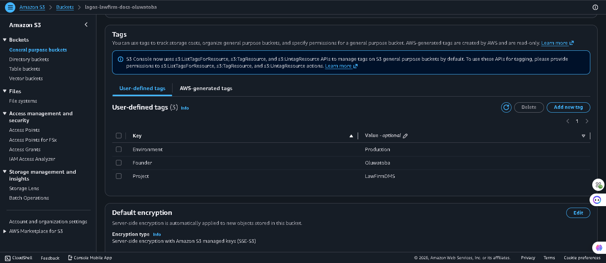
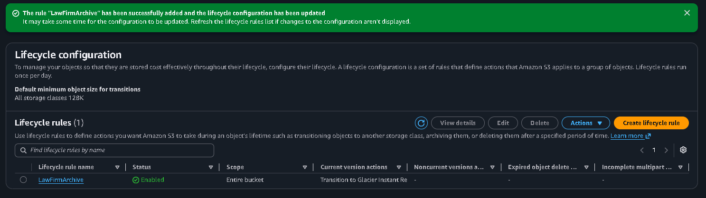
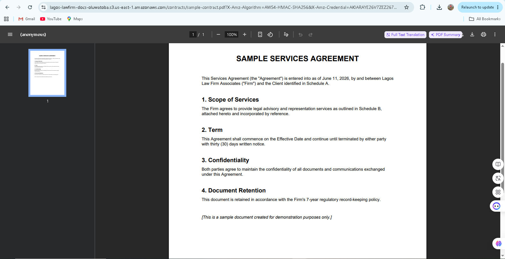
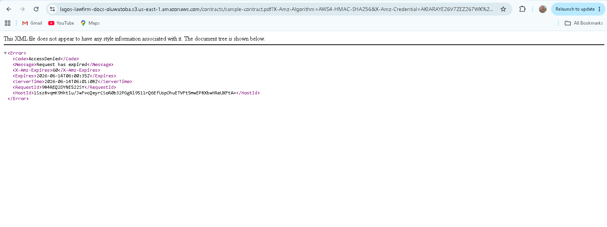
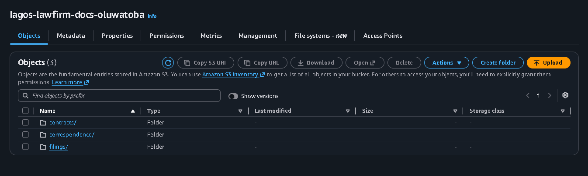

# Lagos Law Firm — S3 Document Management System

A simulated, production-style document storage system built on Amazon S3 for a Lagos-based law firm. This project demonstrates secure document storage, automated compliance archiving, and time-limited client access — all using native AWS S3 features (no servers, no custom backend).

---

## 📐 Architecture Overview

The system is built around a single S3 bucket: `lagos-lawfirm-docs-oluwatoba`, organized using prefixes that simulate a folder structure:

```
lagos-lawfirm-docs-oluwatoba/
├── contracts/
│   └── sample-contract.pdf
├── correspondence/
│   └── client-letter.txt
└── filings/
    └── court-filing.pdf
```

**Why this structure?**
Each prefix represents a document category. This mirrors how a law firm's file server is typically organized — by document type — making it intuitive for staff and easy to apply category-specific access controls or lifecycle rules in the future.

---

## 🔐 Security Controls

| Control | Configuration | Purpose |
|---|---|---|
| **Block Public Access** | Enabled (all 4 settings ON) | Prevents any accidental public exposure of client documents |
| **Default Encryption** | SSE-S3 (Amazon S3-managed keys, AES-256) | All documents are encrypted at rest automatically — no extra code required |
| **Versioning** | Enabled | Protects against accidental overwrites/deletions; every edit is recoverable |
| **Resource Tagging** | `Project=LawFirmDMS`, `Environment=Production`, `Founder=Oluwatoba` | Enables cost tracking, governance, and access policies based on tags |
| **Access Method** | Pre-Signed URLs only (no public bucket policy) | Clients/lawyers get temporary, auditable access links instead of permanent public URLs |

**Screenshot:**


---

## ♻️ Lifecycle Policy — `LawFirmArchive`

Legal records have regulatory retention requirements (commonly 7 years in many jurisdictions). Rather than manually managing storage costs and deletions, a lifecycle rule automates the entire document lifecycle:

| Stage | Trigger (days after upload) | Storage Class | Why |
|---|---|---|---|
| Active | 0 | S3 Standard | Frequently accessed — active case files |
| Cold Storage | 90 | Glacier Instant Retrieval | Cases concluded; rarely accessed but may need fast retrieval |
| Deep Archive | 365 | Glacier Flexible Retrieval | Long-term compliance storage; retrieval within hours is acceptable |
| Expiration | 2,555 (7 years) | Deleted | Meets regulatory retention requirement, then permanently removed |

This rule applies to **all objects** in the bucket, ensuring no document is forgotten or manually mismanaged.

**Screenshot:**


---

## 🔗 Pre-Signed URL Workflow

Lawyers need to share documents with clients without giving them AWS accounts or making files public. **Pre-Signed URLs** solve this: a temporary, cryptographically-signed link that grants time-limited access to a specific object.

### How it works:
1. A staff member with valid IAM credentials runs:
   ```bash
   aws s3 presign s3://lagos-lawfirm-docs-oluwatoba/contracts/sample-contract.pdf --expires-in 3600
   ```
2. This generates a signed URL valid for **1 hour** (3600 seconds).
3. The URL is shared with the client via email — they can open/download the document directly in their browser, with **no AWS login required**.
4. After the expiry time, the same URL returns `AccessDenied: Request has expired` — the link is dead.

### Demonstrated behaviour:

**Working link (within expiry window):**


**Expired link (after expiry window):**


This gives the firm **fine-grained, auditable, time-bound sharing** — far more secure than emailing attachments or making files public.

---

## 💰 Cost Estimate (Illustrative)

Approximate monthly costs for a small law firm with ~50 GB of documents and moderate access patterns (us-east-1 pricing, for reference only — verify current pricing on the [AWS Pricing Page](https://aws.amazon.com/s3/pricing/)):

| Item | Estimated Monthly Cost |
|---|---|
| S3 Standard storage (~10 GB active documents) | ~$0.23 |
| S3 Glacier Instant Retrieval (~20 GB, 90+ days old) | ~$0.08 |
| S3 Glacier Flexible Retrieval (~20 GB, 1yr+ old) | ~$0.07 |
| PUT/GET requests (moderate usage) | ~$0.50 |
| Lifecycle transition requests | ~$0.10 |
| **Estimated Total** | **~$1.00 / month** |

> 💡 At this scale, the dominant cost driver is **requests**, not storage — lifecycle transitions to Glacier dramatically reduce long-term storage costs for compliance archives.

---

## 🗂️ Folder Structure (S3 Console View)



---

## 🚀 Key Takeaways

- **Zero servers, zero custom backend** — the entire DMS runs on S3 features alone
- **Compliance-ready** — automated 7-year retention via lifecycle rules
- **Secure by default** — encryption at rest, no public access, versioned for recovery
- **Client-friendly sharing** — pre-signed URLs provide secure, temporary access without AWS accounts

---

## 🔮 Future Enhancements (Bonus)

- Use **AWS DataSync** to migrate existing on-premises files into this bucket
- Deploy **AWS Storage Gateway (File Gateway)** so lawyers can access S3 documents via a local network drive (NFS/SMB mount) without changing their workflow

---

*Project completed as part of the AWS Cloud Accelerator — Week 5, Day 5.*
